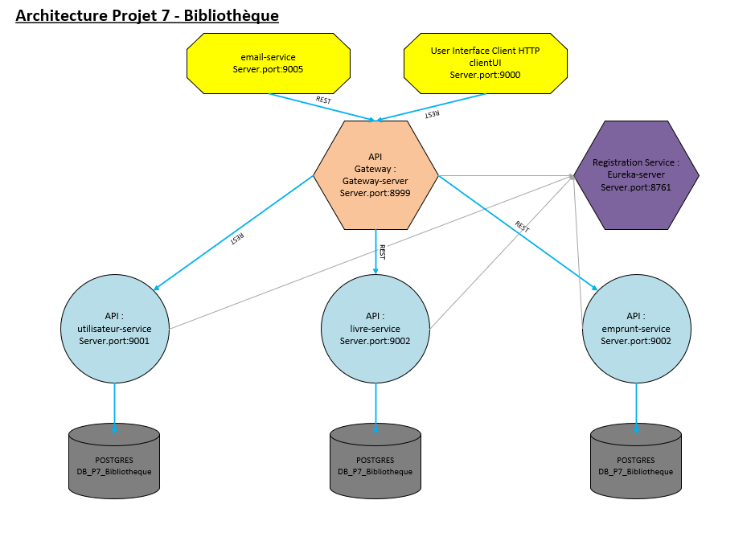
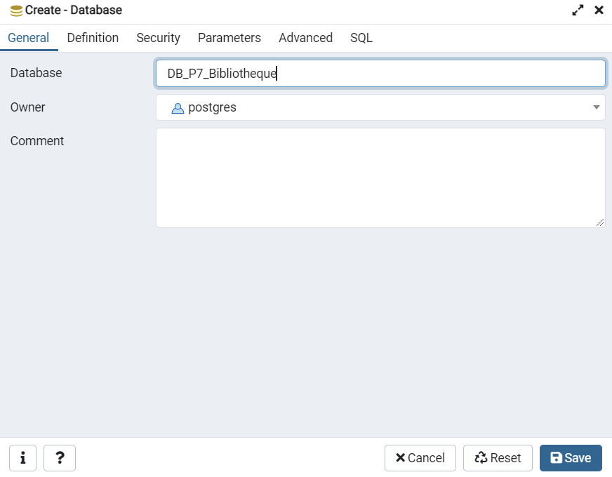
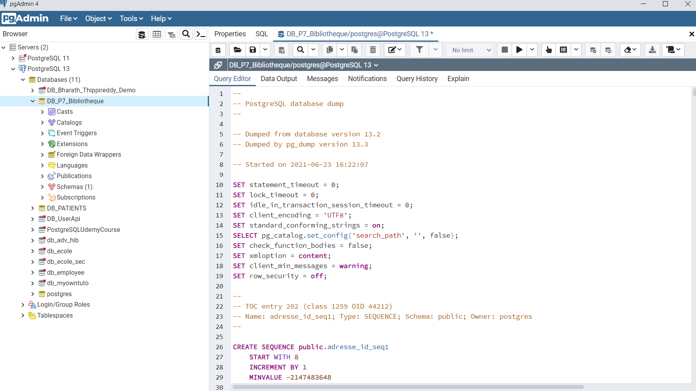
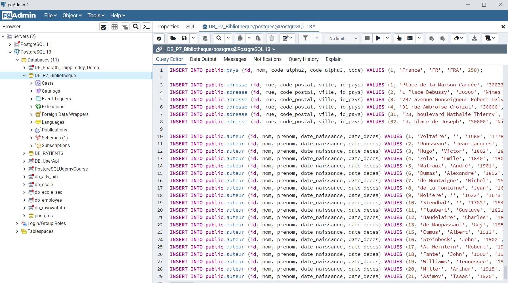

# OpenClassrooms Projet 7 - Developpeur d'Application Java

##Développez le nouveau système d’information de la bibliothèque d’une grande ville

*Créer une API web avec un microservice REST*

*Concevoir une application web avec une approche par composants*

*Respecter les bonnes pratiques de développement en vigueur*

*Sélectionner les langages de programmation adaptés pour le développement de l’application*

*Interagir avec des composants externes*


##Architecture du projet (microservice) : 



##Langages et Technologies utilisées :

+ Java / Html / Css

+ SpringBoot / Web / Jpa / Actuator / Lombok / DevTools

+ PostgreSQL

+ SpringSecurity

+ SpringCloud Gateway

+ SpringMail / SpringScheduler

+ Eureka

+ Feign

+ Thymeleaf / Bootstrap

##Documentation 

La documentation se trouve dans le dossier "1-Documents" : 
+ sql : structure et data de la base de données PostgreSQL
+ uml : diagrammes UML (classes, MPD, arborescence, usecase, activité)

##application.properties => modification de la configuration


+ configuration de la base de données (livre-service, utilisateur-service- emprunt-service) :


## Base de données

- les backup pour la base de données sont dans le répertoire 1-Documents/sql

- Créer une nouvelle base de données DB_P7_Bibliotheque dans pgAdmin : owner => POSTGRES



- Copier/Coller le contenu du fichier structure.sql dans le QueryEditor et executer le script



- Copier/Coller le contenu du fichier data.sql dans le QueryEditor et executer le script



## Installation

IntelliJ = File -> New ->Project from Version Control

url : https://github.com/DocMcCoy30/OCprojet7.git

file : dossier de destination

ou

```
$ cd ../chemin/vers/le/dossier/de/destination
$ git clone https://github.com/DocMcCoy30/OCprojet7.git

$mvn install pour chaque service si nécessaire
```

## Demarrage des services

1- eureka-server

2- gateway-server

3- clientUI

4- utilisateur-service / livre-service / emprunt-service / email-service

5- imageserver contient les images (couvertures des livres notamment) : les infos pour l'installation et la configuration sont dans le ReadMe du module.

Pour chaque service
```
$ cd ../path/to/the/file/target
$ java -jar nom-du-service.jar
```

## Utilisation et fonctionnalités

Page d'accueil accessible à : https://localhost:8999/ (gateway)

2 utilisateurs sont créés dans la base de données :
+ abonné : login : abonne@test.com / password : abonnetest
+ employé : login : employe@test.com/ password : employetest

Les nouveaux utilisateurs crées dans "s'inscrire" seront toujours des abonnés.

*Fonctionnalités d'un USER non connecté :*
+ s'inscrire / se connecter
+ effectuer une recherche
+ consulter le détail d'un livre

*Fonctionnalités d'un ABONNE connecté :*
+ consulter et modifier son profil
+ prolonger un emprunt

*Fonctionnalités d'un EMPLOYE connecté :*
+ enregistrer un emprunt
+ enregistrer un retour